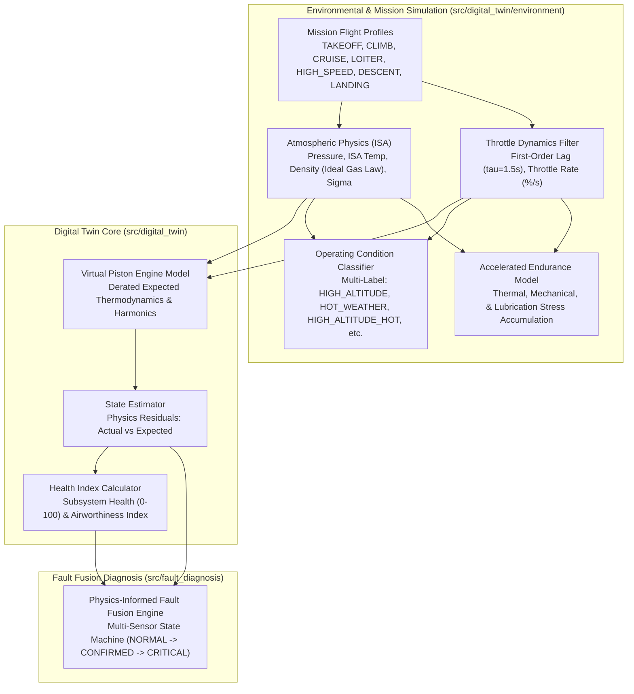
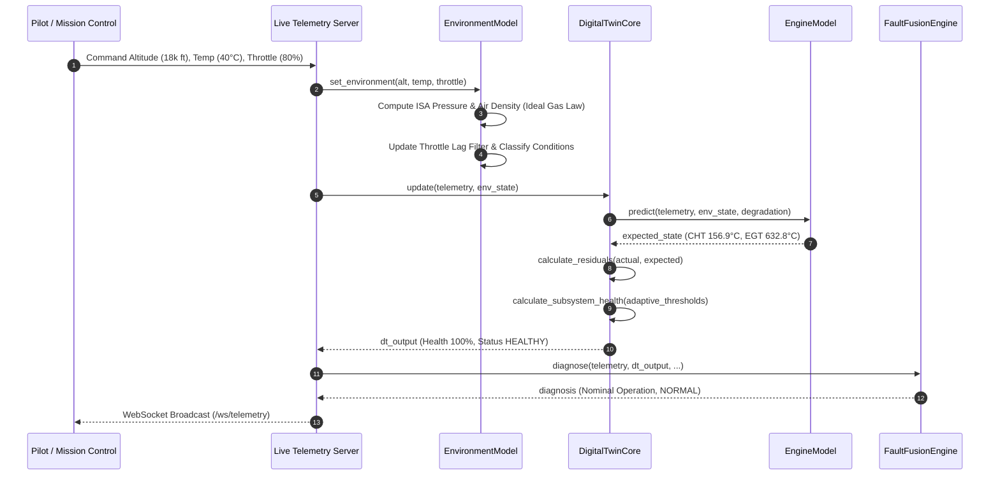
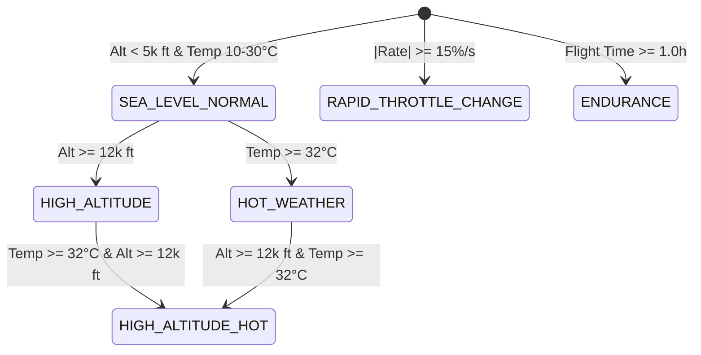
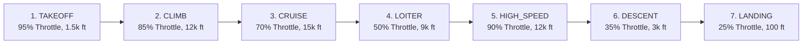

# AeroTwin — Phase 4: Mission & Environmental Simulation

## 1. Overview & Architectural Blueprint

The **AeroTwin Phase 4 Mission & Environmental Simulation** layer establishes physical, deterministic coupling between live ambient conditions, operational flight demands, and the virtual MALE UAV piston engine model. 

In aerospace propulsion digital twins, operational physics follow an invariant principle:
$$\text{Environment} + \text{Operational Inputs} \longrightarrow \text{Digital Twin Virtual Engine} \longrightarrow \text{Expected State} \longrightarrow \text{Physics Residuals} \longrightarrow \text{Health \& Diagnosis}$$



### Core SIH 2026 Objective
Environmental changes (e.g. climbing to 18,000 ft or operating in 40°C desert heat) **must shift the expected nominal engine state**. Because the expected state rises to match the thermodynamic reality, the physics residuals ($|\text{actual} - \text{expected}|$) remain near zero. 
- **Result:** Health remains $>90\%$ (`HEALTHY`) and diagnosis remains `Nominal Operation (NORMAL)` with zero false alarms.
- **Genuine Fault Guarantee:** If a mechanical or cooling fault occurs during extreme flight conditions, the actual telemetry deviates from the environmental expectation, producing large normalized residuals ($>3.0\sigma$) and cleanly triggering fault confirmation.

---

## 2. Environmental Physics Pipeline



---

## 3. Atmospheric Physics Model (ISA)

Located in [`src/digital_twin/environment/atmosphere.py`](file:///d:/GIT/Engine-ered%20To%20Win/src/digital_twin/environment/atmosphere.py).

Implements the **International Standard Atmosphere (ISA)** tropospheric model coupled with the **Ideal Gas Law** for density altitude calculation:

### 1. Temperature Lapse Rate
$$T_{\text{ISA}}(h) = T_0 - L \cdot h$$
where $T_0 = 288.15\text{ K}$ ($15^\circ\text{C}$), $L = 0.0065\text{ K/m}$ ($1.9812^\circ\text{C} / 1000\text{ ft}$), and $h$ is geometric altitude in meters.

### 2. Barometric Pressure
$$P(h) = P_0 \cdot \left(1 - \frac{L \cdot h}{T_0}\right)^{\frac{g_0}{R \cdot L}}$$
where $P_0 = 101.325\text{ kPa}$, $g_0 = 9.80665\text{ m/s}^2$, $R = 287.058\text{ J/(kg}\cdot\text{K)}$, and exponent $\frac{g_0}{R \cdot L} \approx 5.25588$.

### 3. Air Density via Ideal Gas Law
Air density $\rho$ explicitly accounts for non-standard ambient temperature (density altitude effect):
$$\rho(h, T_{\text{amb}}) = \frac{P(h) \cdot 1000}{R \cdot (T_{\text{amb}} + 273.15)}$$

### 4. Density Ratio ($\sigma$)
$$\sigma = \frac{\rho(h, T_{\text{amb}})}{\rho_0}$$
where $\rho_0 = 1.2250\text{ kg/m}^3$.

#### Reference Values Across Flight Envelope
| Altitude (ft) | Ambient Temp (°C) | Pressure (kPa) | Air Density (kg/m³) | Density Ratio ($\sigma$) | Regime Classification |
|:---|:---|:---|:---|:---|:---|
| **0** (Sea Level) | +15.0 (ISA) | 101.33 | 1.2250 | 1.0000 | `SEA_LEVEL_NORMAL` |
| **5,000** | +5.1 (ISA) | 84.31 | 1.0556 | 0.8617 | Moderate Climb |
| **15,000** (Cruise) | -14.7 (ISA) | 57.18 | 0.7708 | 0.6292 | `HIGH_ALTITUDE` |
| **15,000** (Hot Day) | +35.0 (+49.7 ΔISA) | 57.18 | 0.6465 | 0.5278 | `HIGH_ALTITUDE_HOT` |
| **25,000** (Ceiling) | -34.5 (ISA) | 37.60 | 0.5489 | 0.4481 | High Ceiling ISA |
| **25,000** (Hot) | +10.0 (+44.5 ΔISA) | 37.60 | 0.4626 | 0.3776 | Extreme Density Altitude |

---

## 4. Operating Condition Multi-Label Classifier

Located in [`src/digital_twin/environment/operating_condition.py`](file:///d:/GIT/Engine-ered%20To%20Win/src/digital_twin/environment/operating_condition.py).

Operating conditions classify the vehicle's flight status into 10 multi-label states:



| Operating Condition | Trigger Boundary | Significance to Propulsion |
|:---|:---|:---|
| `SEA_LEVEL_NORMAL` | Altitude $< 5,000\text{ ft}$, $10^\circ\text{C} \le T \le 30^\circ\text{C}$ | Standard sea-level density and nominal cooling margins. |
| `HIGH_ALTITUDE` | Altitude $\ge 12,000\text{ ft}$ | Derated ram-air cooling mass flow; lower intake manifold pressure. |
| `HOT_WEATHER` | Ambient Temperature $\ge 32^\circ\text{C}$ | Lower heat-sink gradient across cylinder fins and oil radiator. |
| `HIGH_ALTITUDE_HOT` | Altitude $\ge 12,000\text{ ft}$ AND Temp $\ge 32^\circ\text{C}$ | Severe compound thermal stress; elevated baseline CHT and oil temp. |
| `COLD_WEATHER` | Ambient Temperature $< 0^\circ\text{C}$ | Dense air; higher baseline oil viscosity; increased warmup requirements. |
| `LOW_THROTTLE` | Commanded Throttle $< 40\%$ | Descent, idle, or landing approach; reduced thermodynamic heat generation. |
| `CRUISE` | Throttle $55\% \le \text{throttle} \le 75\%$ | Optimum specific fuel consumption cruise envelope. |
| `HIGH_THROTTLE` | Commanded Throttle $\ge 85\%$ | Maximum continuous climb / takeoff power demand. |
| `RAPID_THROTTLE_CHANGE` | $\left|\frac{d(\text{throttle})}{dt}\right| \ge 15\%/\text{s}$ | Transient load dynamics; mechanical inertia lag filter active. |
| `ENDURANCE` | Cumulative Flight Time $\ge 1.0\text{ hr}$ | Extended continuous operation; continuous component stress tracking. |

---

## 5. Dynamic Throttle Lag Model

Located in [`src/digital_twin/environment/transient_model.py`](file:///d:/GIT/Engine-ered%20To%20Win/src/digital_twin/environment/transient_model.py).

Piston engines and mechanical governors do not change RPM and combustion states instantaneously. The transient model implements a **discrete first-order low-pass filter** representing rotational inertia and fuel induction delay:

$$\tau \frac{d\theta_{\text{eff}}}{dt} + \theta_{\text{eff}} = \theta_{\text{target}}$$

Discrete exact recurrence relation:
$$\theta_{\text{eff}}[k] = \theta_{\text{eff}}[k-1] + \left(1 - e^{-\frac{\Delta t}{\tau}}\right) \left(\theta_{\text{target}} - \theta_{\text{eff}}[k-1]\right)$$

- **Time Constant ($\tau$):** $1.5\text{ s}$ (typical for Rotax constant-speed governor response).
- **Rapid Transient Detection:** Flagged when $\left|\frac{\Delta \theta}{\Delta t}\right| \ge 15.0\%/\text{s}$ or tracking error $|\theta_{\text{target}} - \theta_{\text{eff}}| > 3.0\%$.
- **Deadband Snapping:** Once $|\theta_{\text{target}} - \theta_{\text{eff}}| < 0.5\%$, effective throttle snaps to target to eliminate asymptotic floating-point drift.

```
Throttle Slam (40% -> 90% demand at t = 1.0s):
t = 0.0s: Demand: 40.0% | Effective: 40.0% | Rate:   0.0 %/s | Transient: False
t = 1.0s: Demand: 90.0% | Effective: 64.3% | Rate:  50.0 %/s | Transient: True  (RAPID_THROTTLE_CHANGE)
t = 2.0s: Demand: 90.0% | Effective: 76.8% | Rate:   0.0 %/s | Transient: True
t = 3.0s: Demand: 90.0% | Effective: 83.2% | Rate:   0.0 %/s | Transient: True
t = 4.0s: Demand: 90.0% | Effective: 86.5% | Rate:   0.0 %/s | Transient: True
t = 5.0s: Demand: 90.0% | Effective: 88.2% | Rate:   0.0 %/s | Transient: False (Settled)
t = 7.0s: Demand: 90.0% | Effective: 90.0% | Rate:   0.0 %/s | Transient: False (Converged)
```

---

## 6. Flight Phase Mission Profiles

Located in [`src/digital_twin/environment/mission_profile.py`](file:///d:/GIT/Engine-ered%20To%20Win/src/digital_twin/environment/mission_profile.py).

Seven predefined flight regimes simulate a standard MALE UAV operational sortie:



| Mission Profile | Throttle Target (%) | Altitude Target (ft) | Target Amb Temp (°C) | Primary Operational Condition |
|:---|:---|:---|:---|:---|
| `TAKEOFF` | 95.0% | 1,500 ft | +20.0°C | `HIGH_THROTTLE` |
| `CLIMB` | 85.0% | 12,000 ft | +5.0°C | `HIGH_THROTTLE` / `HIGH_ALTITUDE` |
| `CRUISE` | 70.0% | 15,000 ft | -10.0°C | `HIGH_ALTITUDE` / `CRUISE` |
| `LOITER` | 50.0% | 9,000 ft | +2.0°C | `CRUISE` (Extended surveillance) |
| `HIGH_SPEED` | 90.0% | 12,000 ft | +0.0°C | `HIGH_THROTTLE` / `HIGH_ALTITUDE` |
| `DESCENT` | 35.0% | 3,000 ft | +12.0°C | `LOW_THROTTLE` |
| `LANDING` | 25.0% | 100 ft | +18.0°C | `LOW_THROTTLE` / `SEA_LEVEL_NORMAL` |

---

## 7. Accelerated Endurance & Wear Accumulation

Located in [`src/digital_twin/environment/environment_model.py`](file:///d:/GIT/Engine-ered%20To%20Win/src/digital_twin/environment/environment_model.py).

Long-endurance MALE UAV missions (24–36 hours) can be accelerated during simulations via `simulation_speed` multiplier (1.0x realtime up to 60.0x or 120.0x):

$$\Delta t_{\text{eff}} = \Delta t \cdot S_{\text{speed}}$$

Three cumulative stress metrics are computed every update tick:

1. **Thermal Stress Index ($I_{\text{thermal}}$):**
   $$I_{\text{thermal}} += \left(\frac{\theta_{\text{eff}}}{75.0}\right) \cdot \left[1.0 + \max(0, T_{\text{amb}} - 15.0) \times 0.03\right] \cdot \frac{\Delta t_{\text{eff}}}{3600}$$
2. **Mechanical Stress Index ($I_{\text{mech}}$):**
   $$I_{\text{mech}} += \left[\left(\frac{\theta_{\text{eff}}}{75.0}\right)^{1.5} + \left(\frac{|\dot{\theta}|}{20.0}\right) \times 0.5\right] \cdot \frac{\Delta t_{\text{eff}}}{3600}$$
3. **Lubrication Stress Index ($I_{\text{lub}}$):**
   $$I_{\text{lub}} += \max\left(0.3, \frac{\theta_{\text{eff}}}{75.0} \times 1.1\right) \cdot \frac{\Delta t_{\text{eff}}}{3600}$$

---

## 8. Virtual Engine Expected State Derating

Located in [`src/digital_twin/engine_model.py`](file:///d:/GIT/Engine-ered%20To%20Win/src/digital_twin/engine_model.py).

The surrogate physics model updates its expected predictions according to operational inputs:

```
Inputs:
  theta = effective_throttle_pct
  h = altitude_ft
  T_amb = ambient_temp_c

Calculations:
  d_theta = theta - 75.0%
  d_temp = T_amb - 15.0°C
  density_deficit = max(0.0, 1.0 - (sigma(h) / sigma_baseline))

Expected State Formulations:
  RPM_exp      = 2450.0 + 12.0 * d_theta
  FuelFlow_exp = 17.6 + 0.28 * d_theta
  CHT_exp      = 142.0 + 0.90 * d_theta + 0.35 * d_temp + 18.0 * density_deficit
  EGT_exp      = 615.0 + 2.40 * d_theta + 0.20 * d_temp + 8.0 * density_deficit
  OilTemp_exp  = 92.0 + 0.40 * d_theta + 0.30 * d_temp + 10.0 * density_deficit
  OilP_exp     = 4.69 + 0.0015 * (RPM_exp - 2450.0) - 0.018 * (OilTemp_exp - 92.0)
  Vib_exp      = 1.42 * (RPM_exp / 2450.0)^1.80
```

---

## 9. False Alarm Immunity & Adaptive Thresholds

### The Challenge
At sea level ($15^\circ\text{C}$), nominal CHT is $142^\circ\text{C}$ with a caution limit of $165^\circ\text{C}$.
At $18,000\text{ ft}$ altitude and $40^\circ\text{C}$ ambient, nominal healthy expected CHT rises to $156.9^\circ\text{C}$.
In extreme heat ($45^\circ\text{C}$ at $12,000\text{ ft}$), normal expected CHT is $161.5^\circ\text{C}$.
If the caution threshold remained fixed at $165^\circ\text{C}$, minor sensor noise could trigger false alerts despite the engine operating 100% nominally within its physics envelope.

### The Adaptive Solution
In [`src/digital_twin/health_index.py`](file:///d:/GIT/Engine-ered%20To%20Win/src/digital_twin/health_index.py) and [`src/unified_telemetry.py`](file:///d:/GIT/Engine-ered%20To%20Win/src/unified_telemetry.py), caution limits adapt dynamically to the expected thermodynamic state:

$$\text{Caution}_{\text{eff}}(\text{CHT}) = \max\left(165.0^\circ\text{C}, \text{CHT}_{\text{exp}} + 18.0^\circ\text{C}\right)$$
$$\text{Caution}_{\text{eff}}(\text{EGT}) = \max\left(680.0^\circ\text{C}, \text{EGT}_{\text{exp}} + 45.0^\circ\text{C}\right)$$

### Validation Results (Zero False Alarms)
| Test Environment | Expected CHT | Actual CHT | Normalized Residual | Health Index | Status | Fault Diagnosis | Verification |
|:---|:---|:---|:---|:---|:---|:---|:---|
| **Sea Level Standard** (0 ft, 15°C) | 142.0°C | 142.5°C | $+0.17\sigma$ | **100.0%** | `HEALTHY` | `Nominal Operation` | **PASS** |
| **Cruise Baseline** (15k ft, 15°C) | 142.0°C | 142.5°C | $+0.17\sigma$ | **100.0%** | `HEALTHY` | `Nominal Operation` | **PASS** |
| **High-Alt Hot** (18k ft, 40°C) | 156.9°C | 157.4°C | $+0.17\sigma$ | **100.0%** | `HEALTHY` | `Nominal Operation` | **PASS** |
| **Extreme Basin** (12k ft, 45°C) | 161.5°C | 162.0°C | $+0.17\sigma$ | **99.9%** | `HEALTHY` | `Nominal Operation` | **PASS** |

---

## 10. Genuine Injected Fault Isolation

When a genuine failure occurs in an extreme environment, the actual telemetry deviates from the environmental expectation.

### Overheating Fault Injected at 18,000 ft / 40°C Ambient
- **Expected Normal CHT:** $156.9^\circ\text{C}$
- **Injected Actual CHT:** $201.9^\circ\text{C}$ ($+45.0^\circ\text{C}$ above expected)
- **Physics Residual:** $+5.68\sigma$ normalized deviation

```
Tick 1: CHT=201.9°C | Resid=+5.68σ | Thermal Health=0.0% | Diag: Overheating (ANOMALY,   CRITICAL)
Tick 2: CHT=201.9°C | Resid=+5.53σ | Thermal Health=0.0% | Diag: Overheating (ANOMALY,   CRITICAL)
Tick 3: CHT=201.9°C | Resid=+5.47σ | Thermal Health=0.0% | Diag: Overheating (SUSPECTED, CRITICAL)
Tick 4: CHT=201.9°C | Resid=+5.40σ | Thermal Health=0.0% | Diag: Overheating (SUSPECTED, CRITICAL)
Tick 5: CHT=201.9°C | Resid=+5.40σ | Thermal Health=0.0% | Diag: Overheating (CONFIRMED, CRITICAL)
Tick 6: CHT=201.9°C | Resid=+5.40σ | Thermal Health=0.0% | Diag: Overheating (CONFIRMED, CRITICAL)
```
- Thermal health drops to **0.0%**.
- Fault Fusion Engine confirms `Overheating` at **CRITICAL** severity.
- Sensor diagnosis confirms all 3 thermal sensors (`cht_c`, `egt_c`, `oil_temperature_c`) degraded simultaneously, ruling out sensor failure.

---

## 11. Telemetry Server Integration & WebSockets

Located in [`live_telemetry_server.py`](file:///d:/GIT/Engine-ered%20To%20Win/live_telemetry_server.py).

### New REST Endpoints
1. **`POST /api/environment`**
   ```json
   {
     "altitude_ft": 18000.0,
     "ambient_temp_c": 38.0,
     "throttle_pct": 85.0
   }
   ```
   *Response:* Returns full `environment` block with recalculated atmospheric parameters.

2. **`POST /api/mission`**
   ```json
   {
     "profile": "CLIMB"
   }
   ```
   *Response:* Activates profile, adjusts altitude/throttle targets, and triggers zero-latency broadcast.

3. **`POST /api/endurance`**
   ```json
   {
     "simulation_speed": 10.0
   }
   ```
   *Response:* Sets accelerated simulation multiplier.

### WebSocket Commands via `/ws/telemetry`
Clients can stream live commands:
- `{"altitude": 18000}`
- `{"ambient_temp": 40}`
- `{"throttle": 85}`
- `{"mission_profile": "LOITER"}`
- `{"simulation_speed": 60.0}`

---

## 12. Frontend Contract & TypeScript Interfaces

Located in [`frontend/src/types/telemetry.ts`](file:///d:/GIT/Engine-ered%20To%20Win/frontend/src/types/telemetry.ts).

```typescript
export interface EnvironmentEnduranceStress {
  thermal_stress: number;
  mechanical_stress: number;
  lubrication_stress: number;
}

export interface EnvironmentPayload {
  altitude_ft: number;
  ambient_temp_c: number;
  pressure_kpa: number;
  air_density_kg_m3: number;
  density_ratio: number;
  relative_density_to_cruise: number;
  isa_temp_c: number;
  isa_temp_dev_c: number;
  throttle_pct: number;
  effective_throttle_pct: number;
  throttle_rate: number;
  is_transient: boolean;
  operating_conditions: string[];
  primary_condition: string;
  operating_condition: string;
  mission_profile: string;
  mission_time_sec: number;
  simulation_speed: number;
  endurance_hours: number;
  endurance_stress?: EnvironmentEnduranceStress;
}
```

---

## 13. Test Matrix & Validation Results

Executed via `python tests/test_environment_model.py`:

```
======================================================================
AeroTwin Phase 4 Automated Test Suite - Mission & Environmental Simulation
======================================================================

  [PASS] Test 01: Atmospheric Physics (ISA Pressure, Density & Monotonic Altitude)
         SL: P=101.33 kPa, rho=1.225 kg/m3. 25k ft: rho=0.4546 kg/m3 (sigma=0.3711)
  [PASS] Test 02: Temperature & Ideal Gas Law (Density Altitude Effect)
         15k ft density: -20°C -> 0.7869 kg/m3, +15°C -> 0.6913 kg/m3, +45°C -> 0.6261 kg/m3
  [PASS] Test 03: Operating Condition Multi-Label Classification
         Correctly classified: SEA_LEVEL_NORMAL, HIGH_ALTITUDE_HOT, and ['COLD_WEATHER', 'LOW_THROTTLE']
  [PASS] Test 04: Throttle Transient Lag Dynamics & Rapid Rate Detection
         Lag verified: transient rate=0.0 %/s, converged=90.0%
  [PASS] Test 05: Flight Phase Mission Profiles (7 Predefined Flight Regimes)
         All 7 mission profiles verified. Last profile LANDING: thr=25.0%, alt=100.0 ft
  [PASS] Test 06: Accelerated Endurance Stress Accumulation
         Simulated 1.00 hrs at 60x speed: thermal_stress=1.8133, mech=1.2065
  [PASS] Test 07: Virtual Engine Model Coupling (Sensitivities & Deratings)
         Coupling verified: CHT 142.0°C -> 157.3°C (+15.3°C), EGT 615.0°C -> 632.8°C
  [PASS] Test 08: Environment-Only Variation Does NOT Trigger Engine Faults
         15k ft / 40°C ambient: Health=100.0 (HEALTHY), Diag=Nominal Operation (NORMAL)
  [PASS] Test 09: Real Injected Fault Detection Under Extreme Environments
         Overheating confirmed in extreme env: Thermal=0.0, Fault=Overheating, State=CONFIRMED, Severity=CRITICAL
  [PASS] Test 10: DigitalTwinCore Environment Integration & API Methods
         DigitalTwinCore environment methods verified. Mission=CLIMB, Primary=HIGH_ALTITUDE
======================================================================
PHASE 4 TEST SUMMARY: 10/10 tests passed (100% Pass Rate)
======================================================================
```

### Full Regression Suite Verification
- `tests/test_fault_fusion.py`: **15/15 passed**
- `tests/test_health_index.py`: **12/12 passed**
- `tests/test_digital_twin.py`: **10/10 passed**
- `src/test_sensor_diagnosis.py`: **8/8 passed**
- Next.js Turbopack `npm run build`: **Compiled successfully in 285ms, zero errors**

---

## 14. Demonstration Guide & Operational Runbook

To execute the live interactive terminal demonstrator:
```bash
python scripts/demo_environment_simulation.py
```

To run the automated test suite:
```bash
python tests/test_environment_model.py
```

To start the AeroTwin live telemetry and Digital Twin server:
```bash
python live_telemetry_server.py
```
