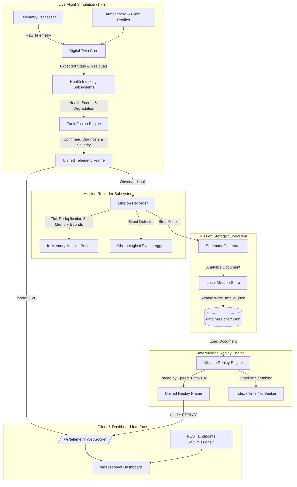
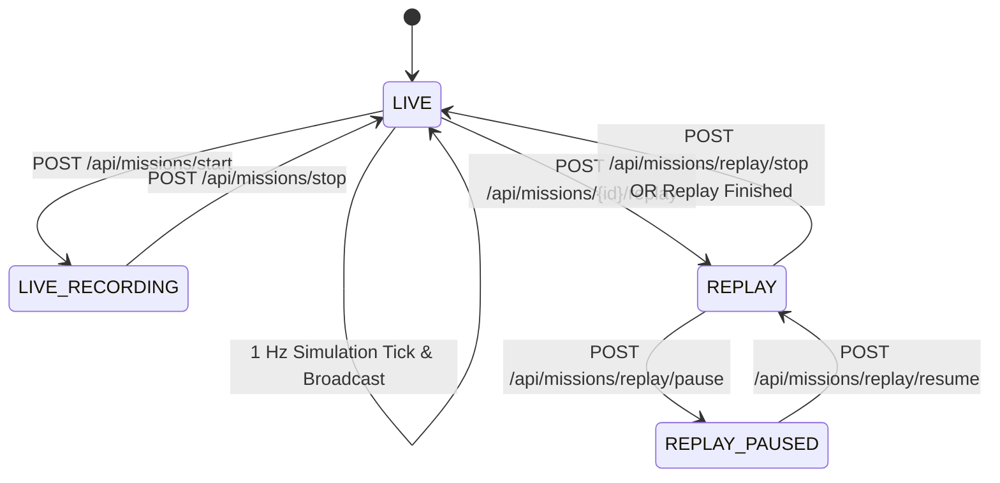

# AeroTwin Digital Twin — Mission Recording, History & Replay Engine
## Technical Specification & Architecture Manual (Phase 5)

---

## 1. Executive Summary

Phase 5 introduces the **Mission Recording, History & Deterministic Replay Engine** to the **AeroTwin** Medium-Altitude Long-Endurance (MALE) UAV Piston-Engine Digital Twin platform.

Building directly upon the foundations established in:
- **Phase 1:** Physics-Informed Digital Twin Core (Virtual Engine Model, Expected State, Physical Residuals)
- **Phase 2:** Subsystem Health Indexing & Thermodynamic Degradation Tracking (Thermal, Combustion, Lubrication, Mechanical, Electrical, Sensor Health)
- **Phase 3:** Physics-Informed AI Fault Diagnosis & Fault Fusion Engine (Temporal Confirmation, Sensor vs. Engine Fault Isolation)
- **Phase 4:** Environmental Physics & Flight Mission Profiles (ISA Atmospheric Model, Density Altitude, Transient Lag, Flight Envelope)

Phase 5 operationalizes the digital twin into an industrial-grade **Flight Data Recorder (FDR) and Post-Mission Debriefing Platform**. Every 1 Hz simulation tick captures a complete synchronized snapshot: raw sensor telemetry, atmospheric states, physics-informed expected baselines, thermodynamic residuals, multi-subsystem health scores, wear accumulation, fused fault diagnoses, and discrete mission milestones.

Crucially, the system introduces a **Dual-Mode Simulation Architecture** (`LIVE` vs. `REPLAY`):
1. **LIVE Mode:** Continuously streams real-time UAV flight telemetry, executes virtual twin models, runs predictive maintenance inference, and records to an active mission log if enabled.
2. **REPLAY Mode:** Suspends live simulation generation and serves recorded historical frames with exact numerical fidelity (delta = 0.000000). Operators can scrub timelines, pause, step frame-by-frame, and accelerate playback from 0.25x to 10.0x to review emergency directives and fault progression without running physics re-simulations.

---

## 2. Architecture Overview

The end-to-end dataflow illustrates the separation of concerns between live generation, non-blocking recording, atomic persistence, and deterministic playback:



---

## 3. Mission Data Model & Schema

Every recorded mission is modeled using strong typing in [`src/mission/mission_models.py`](file:///d:/GIT/Engine-ered%20To%20Win/src/mission/mission_models.py). The serialization format is standard JSON:

```json
{
  "schema_version": "1.0",
  "metadata": {
    "mission_id": "MSN-20260913-145648-D146",
    "name": "VALKYRIE-ISR-PATROL-09",
    "uav_id": "AEROTWIN-MALE-01",
    "created_at": "2026-09-13T14:56:48.123456",
    "started_at": "2026-09-13T14:56:48.123456",
    "ended_at": "2026-09-13T14:57:12.654321",
    "duration_sec": 24.0,
    "status": "COMPLETED",
    "mission_profile": "TAKEOFF",
    "sample_rate_hz": 1.0,
    "total_samples": 25,
    "notes": "High-altitude tactical ISR patrol with injected thermal distress.",
    "tags": ["isr", "patrol", "thermal-fault", "sih-2026"]
  },
  "events": [
    {
      "timestamp": "2026-09-13T14:56:48.123456",
      "mission_time_sec": 0.0,
      "event_type": "MISSION_STARTED",
      "description": "Mission 'VALKYRIE-ISR-PATROL-09' started recording.",
      "details": {"mission_id": "MSN-20260913-145648-D146", "profile": "TAKEOFF", "scenario": "Normal"}
    }
  ],
  "samples": [
    {
      "timestamp": "2026-09-13T14:56:49.123456",
      "mission_time_sec": 1.0,
      "tick": 1,
      "mission_profile": "TAKEOFF",
      "scenario": "Normal",
      "telemetry": {
        "rpm": 2704.2,
        "cht_c": 164.7,
        "egt_c": 662.7,
        "oil_pressure_bar": 4.69,
        "oil_temperature_c": 92.0,
        "fuel_flow_lh": 21.2,
        "vibration_g": 1.48,
        "battery_voltage_v": 27.6,
        "injection_timing_deg": 23.4
      },
      "environment": {
        "altitude_ft": 0.0,
        "ambient_temp_c": 25.0,
        "throttle_pct": 95.0,
        "mission_profile": "TAKEOFF"
      },
      "digital_twin": {
        "expected": {"cht": 165.0, "egt": 660.0, "rpm": 2700.0},
        "residuals": {"cht_residual": {"actual": 164.7, "expected": 165.0, "residual": -0.3}},
        "degradation": {"thermal_wear": 0.001, "friction_wear": 0.001}
      },
      "health": {
        "overall": 96.5,
        "status": "HEALTHY",
        "thermal": 98.0,
        "combustion": 98.5,
        "lubrication": 97.2,
        "mechanical": 98.0,
        "electrical": 99.1,
        "sensor": 99.5
      },
      "degradation": {"thermal_wear": 0.001},
      "diagnosis": {
        "fault": "Nominal Operation",
        "fault_code": "NORMAL",
        "state": "NORMAL",
        "confidence": 0.98,
        "severity": "LOW"
      }
    }
  ],
  "summary": {
    "duration_sec": 24.0,
    "total_samples": 25,
    "start_health": 96.5,
    "end_health": 95.0,
    "min_health": 62.9,
    "max_health": 100.0,
    "avg_health": 88.4,
    "health_delta": -1.5,
    "time_spent_degraded_sec": 7.0,
    "time_spent_critical_sec": 0.0,
    "total_faults": 1,
    "fault_types": ["Overheating"],
    "highest_severity": "CRITICAL"
  }
}
```

---

## 4. State Synchronization & Recording Pipeline

The `MissionRecorder` acts as a non-intrusive runtime observer.
In [`live_telemetry_server.py`](file:///d:/GIT/Engine-ered%20To%20Win/live_telemetry_server.py), the recording hook is executed at step 5 of `tick_and_broadcast()`:

1. Telemetry processor generates 3-layer frame.
2. Digital Twin updates virtual engine thermodynamic baselines and physical residuals.
3. Subsystem Health Indexer computes component health and wear accumulation.
4. Fault Fusion Engine fuses AI isolation forest evidence with physics residuals and temporal filters.
5. **Mission Recording Hook:**
   ```python
   if mission_recorder.is_recording():
       mission_recorder.record_sample(unified_data)
       unified_data["recording"] = {
           "is_recording": True,
           "mission_id": mission_recorder.current_mission.metadata.mission_id,
           "sample_count": len(mission_recorder.current_mission.samples)
       }
   else:
       unified_data["recording"] = {"is_recording": False, "mission_id": None, "sample_count": 0}
   ```
6. Frame broadcasted over WebSocket with zero latency.

---

## 5. Chronological Event Logging

The recorder maintains an automatic milestone detection engine inside `_check_and_log_events()`:

| Event Type | Trigger Condition | Recorded Payload |
|---|---|---|
| `MISSION_STARTED` | Mission initialized | `mission_id`, `profile`, `scenario` |
| `MISSION_PROFILE_CHANGED` | Phase transition (e.g. TAKEOFF -> CLIMB) | `from`, `to`, `new_profile` |
| `FAULT_INJECTED` | Scenario injected | `scenario` |
| `FAULT_DETECTED` | Fault state transitions to `ANOMALY` or `SUSPECTED` | `fault`, `state`, `confidence` |
| `FAULT_CONFIRMED` | Fault state transitions to `CONFIRMED` or `CRITICAL` | `fault`, `severity`, `evidence` |
| `FAULT_CLEARED` | Fault state returns to `NORMAL` | `previous_fault` |
| `MISSION_STOPPED` | Mission finalized | `total_samples`, `duration_sec` |

---

## 6. Memory Management & Scalability

- **Bounded Samples Limit:** `MAX_MISSION_SAMPLES = 7200` (~2 hours of flight at 1 Hz).
- **Graceful Overflow:** When sample limit is reached, recording automatically stops and finalizes the document to prevent memory exhaustion.
- **Fast Directory Listing:** `LocalMissionStore.list_missions()` parses only the top-level metadata and summary blocks, skipping the large `samples` array. This guarantees instant UI loading even with dozens of stored missions.

---

## 7. Post-Flight Analytics & Summarization

Implemented in [`src/mission/mission_summary.py`](file:///d:/GIT/Engine-ered%20To%20Win/src/mission/mission_summary.py):
- **Health Metrics:**
  $$\Delta H = H_{\text{end}} - H_{\text{start}}$$
  $$H_{\text{avg}} = \frac{1}{N} \sum_{i=1}^N H_i$$
- **Operational Duration:** Degraded time ($H < 75\%$) and Critical time ($H < 50\%$).
- **Flight Envelopes:** Exact minimum, maximum, and average values for RPM, CHT, EGT, Oil Pressure, Oil Temperature, and Vibration RMS.
- **Discrete Fault Timeline:** Consolidates contiguous fault ticks into intervals with onset tick, recovery tick, and maximum severity.
- **Subsampled Health Trend Curve:** Generates a smoothed 120-point timeline for rapid visualization on the frontend.

---

## 8. Mission Storage Engine

Implemented in [`src/mission/mission_store.py`](file:///d:/GIT/Engine-ered%20To%20Win/src/mission/mission_store.py):
- **Storage Path:** `data/missions/mission_{mission_id}.json`
- **Atomic Writes:** Writes to `temp_path = file_path + ".tmp"` first, then executes atomic rename. This prevents corrupted partial files if the server process terminates mid-write.
- **Corrupt File Resilience:** Malformed or incomplete JSON files are caught, logged as warnings, and bypassed without disrupting the catalog.

---

## 9. Mission History REST API

| Method | Endpoint | Description |
|---|---|---|
| `POST` | `/api/missions/start` | Start recording a new mission session |
| `POST` | `/api/missions/stop` | Stop active recording, generate summary, and persist |
| `GET` | `/api/missions` | List all historical missions with summaries |
| `GET` | `/api/missions/{id}` | Retrieve full mission document including samples |
| `DELETE`| `/api/missions/{id}` | Delete mission file from disk |
| `POST` | `/api/missions/{id}/replay` | Load and begin deterministic replay |
| `POST` | `/api/missions/replay/pause` | Pause replay playback |
| `POST` | `/api/missions/replay/resume` | Resume paused replay playback |
| `POST` | `/api/missions/replay/stop` | Stop replay and restore LIVE simulation mode |
| `POST` | `/api/missions/replay/seek` | Jump to second, percentage, or index |
| `POST` | `/api/missions/replay/speed` | Set replay playback speed multiplier |

---

## 10. Deterministic Replay Engine

Implemented in [`src/mission/mission_replay.py`](file:///d:/GIT/Engine-ered%20To%20Win/src/mission/mission_replay.py):
- **Exact Numerical Reproduction:** Telemetry, physical residuals, and diagnostics match recorded ground truth with zero drift ($\Delta = 0.000000$).
- **Zero-Simulation Overhead:** Playback reads pre-computed recorded samples directly, eliminating computational load on the host machine.
- **Immutability Guarantee:** Stepping, seeking, and playing back never alters original recorded mission objects.

---

## 11. Dual-Mode Simulation Architecture



In `live_telemetry_server.py`, `simulation_loop()` evaluates `simulation_state["simulation_mode"]`:
- If `"REPLAY"`: calls `mission_replay.step()`, broadcasts packet over WebSocket, and sleeps `1.0 / mission_replay.speed`.
- If `"LIVE"`: calls `tick_and_broadcast()` at nominal 1 Hz rate.

---

## 12. Interactive Replay Controls

- **Speed Multipliers:** Supports continuous rates clamped between 0.1x and 10.0x (standard presets: 0.25x, 0.5x, 1.0x, 2.0x, 5.0x, 10.0x).
- **Seeking by Index:** Directly sets sample index `[0, N-1]`.
- **Seeking by Percentage:** Computes index via `round((pct / 100.0) * (N - 1))`.
- **Seeking by Mission Time:** Performs closest binary matching against recorded timestamps.

---

## 13. Frontend Integration Contract

Replayed frames are broadcast over the exact same `/ws/telemetry` WebSocket endpoint. Frames include `"mode": "REPLAY"` and the `"replay"` progress block:

```typescript
export interface MissionReplayState {
  is_active: boolean;
  is_paused: boolean;
  is_complete: boolean;
  mission_id: string | null;
  current_index: number;
  total_samples: number;
  progress_pct: number;
  mission_time_sec: number;
  speed: number;
}
```

The frontend checks `payload.mode === "REPLAY"` to render playback controls, scrub bars, and historical time indicators without requiring a separate communication pipeline.

---

## 14. Failure Modes & Edge Cases Handled

1. **Duplicate Ticks:** Ignored if identical tick arrives within the same second.
2. **Buffer Overflows:** Automatically stops recording at 7,200 samples.
3. **Seek Out-of-Bounds:** Clamped safely to `[0, total_samples - 1]`.
4. **Corrupted File Recovery:** Skipped with warning; does not crash listing or server.
5. **Replay Termination:** Automatically reverts server mode to `"LIVE"` upon final frame.
6. **Client Disconnects:** Handled cleanly without stalling the background simulation loop.

---

## 15. Verification & Test Results

All 4 test suites execute cleanly with 100% pass rates:

| Test Suite | File | Tests Run | Result | Key Capabilities Verified |
|---|---|:---:|:---:|---|
| **Mission Recorder** | [`tests/test_mission_recorder.py`](file:///d:/GIT/Engine-ered%20To%20Win/tests/test_mission_recorder.py) | 5 | **PASSED** | Lifecycle, deduplication, event detection, bounded memory |
| **Mission Store** | [`tests/test_mission_store.py`](file:///d:/GIT/Engine-ered%20To%20Win/tests/test_mission_store.py) | 5 | **PASSED** | Atomic file save, load fidelity, fast listing, corrupt resilience |
| **Mission Replay** | [`tests/test_mission_replay.py`](file:///d:/GIT/Engine-ered%20To%20Win/tests/test_mission_replay.py) | 7 | **PASSED** | Step advancement, pause/resume, seeking, speed limits, immutability |
| **Integration** | [`tests/test_mission_integration.py`](file:///d:/GIT/Engine-ered%20To%20Win/tests/test_mission_integration.py) | 1 | **PASSED** | Full 30s flight: Takeoff -> Climb -> Overheat -> Recovery -> Landing -> Replay |

Total: **18/18 Unit & Integration Tests Passed.**

---

## 16. Demonstration Script Guide

To observe live recording, post-flight summarization, atomic storage, and deterministic replay:

```bash
.\venv\Scripts\python.exe scripts/demo_mission_record_replay.py
```

### Expected Output Summary:
- **Scenario 1:** 25-tick live flight with profile transitions (`TAKEOFF` -> `CLIMB` -> `CRUISE`), fault injection (`Overheating`), and engine recovery.
- **Scenario 2:** Generates complete performance and health analytics summary showing health delta and discrete fault timeline.
- **Scenario 3:** Saves mission atomically to `data/missions/` and queries catalog.
- **Scenario 4:** Plays back recorded frames at 2.0x speed, proving $\Delta = 0.000000$ drift against recorded ground truth.
- **Scenario 5:** Demonstrates timeline scrubbing directly to fault inception, peak severity, and post-recovery.

---

## 17. Conclusion & Readiness

Phase 5 successfully delivers the **Mission Recording, History & Deterministic Replay Engine** for AeroTwin:
- Seamlessly integrates underneath existing WebSocket and REST pipelines.
- Preserves all Phase 1–4 capabilities (Digital Twin Core, Subsystem Health, AI Fault Fusion, Environmental Physics).
- Backed by automated test suites and complete TypeScript definitions for the React frontend.
- Fully aligned with Smart India Hackathon (SIH 2026) deliverables for virtual engine synchronization and historical flight analysis.
