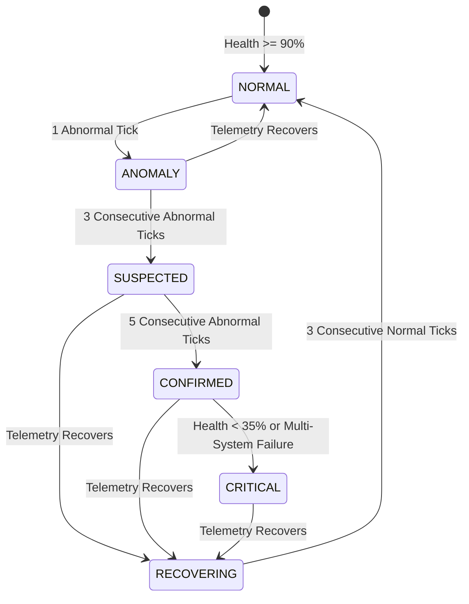

# AeroTwin Phase 3: Physics-Informed AI Fault Diagnosis + Sensor/Engine Fault Fusion

## 1. Executive Summary & Architecture Overview

The **AeroTwin** Phase 3 subsystem implements an advanced **Physics-Informed Fault Fusion Layer** (`src/fault_diagnosis/`) designed specifically for MALE UAV piston engines (modeled after the turbocharged Rotax 914/915 powertrain).

Rather than relying purely on heuristic threshold checks or black-box machine learning classifications, the Phase 3 architecture fuses seven distinct layers of diagnostic intelligence:
1. **Live Raw Telemetry**: Real-time sensor channels (RPM, CHT, EGT, Oil Pressure, Oil Temp, Fuel Flow, Vibration, Bus Voltage, Injection Timing).
2. **Digital Twin Virtual Model**: Physics-grounded expected engine state dynamically synchronized to throttle, altitude, and ambient air conditions.
3. **Physics Residuals**: Analytical deviations ($\Delta = \text{Actual} - \text{Expected}$) and percentage deviations relative to thermodynamic and hydrodynamic baselines.
4. **Subsystem Health Indices**: Calibrated 0–100 health metrics across 6 core subsystems (Thermal, Combustion, Lubrication, Mechanical, Electrical, Sensors).
5. **Component Degradation States**: Accumulated continuous mechanical and physical wear states ($0.0 \sim 1.0$).
6. **Isolation Forest Machine Learning**: Unsupervised anomaly detection score isolating statistical out-of-distribution operating points.
7. **Random Forest Cross-Sensor Regressors**: Per-sensor machine learning models that isolate sensor hardware faults from true engine multi-system anomalies.

```
                  ┌─────────────────────────────────────┐
                  │          LIVE TELEMETRY             │
                  └──────────────────┬──────────────────┘
                                     │
                  ┌──────────────────▼──────────────────┐
                  │       DIGITAL TWIN ENGINE CORE      │
                  └──────┬───────────┬───────────┬──────┘
                         │           │           │
            ┌────────────▼──┐ ┌──────▼─────┐ ┌───▼────────────┐
            │ EXPECTED STATE│ │ RESIDUALS  │ │SUBSYSTEM HEALTH│
            └────────────┬──┘ └──────┬─────┘ └───┬────────────┘
                         │           │           │
                         └───────────┼───────────┘
                                     │
                         ┌───────────▼───────────┐
                         │  EXISTING AI MODELS   │
                         │ ───────────────────── │
                         │ • Isolation Forest    │
                         │ • Cross-Sensor RF     │
                         │ • infer_fault Rules   │
                         └───────────┬───────────┘
                                     │
               ┌─────────────────────▼─────────────────────┐
               │            FAULT FUSION ENGINE            │
               │         (src/fault_diagnosis/)            │
               └─────────┬───────────┬───────────┬─────────┘
                         │           │           │
             ┌───────────▼──┐ ┌──────▼─────┐ ┌───▼─────────────┐
             │PRIMARY FAULT │ │ CONFIDENCE │ │     EVIDENCE    │
             │& ALTERNATIVES│ │  (0 - 100%)│ │ (HUMAN READABLE)│
             └───────────┬──┘ └──────┬─────┘ └───┬─────────────┘
                         │           │           │
                         └───────────┼───────────┘
                                     │
                         ┌───────────▼───────────┐
                         │   SEVERITY & STATE    │
                         │ ───────────────────── │
                         │ INFO / LOW / MED /    │
                         │ HIGH / CRITICAL       │
                         └───────────┬───────────┘
                                     │
                         ┌───────────▼───────────┐
                         │  MAINTENANCE CONTEXT  │
                         │    (FOR PHASES 4/5)   │
                         └───────────────────────┘
```

---

## 2. Physics Residuals as Diagnostic Evidence

Traditional threshold-based systems generate high false-alarm rates when environmental conditions shift (e.g. high altitude cruise or hot ambient air). The Phase 3 architecture treats **Digital Twin Residuals** as first-class diagnostic evidence:

$$\text{Residual}_i = \text{Actual}_i - \text{Expected}_i$$
$$\text{Normalized Residual}_i = \frac{\text{Residual}_i}{\sigma_i}$$
$$\text{Percentage Deviation}_i = \frac{\text{Residual}_i}{\text{Expected}_i} \times 100\%$$

### Primary Physics Channels:
| Parameter | Scale Normalizer ($\sigma_i$) | Physics Significance |
|---|---|---|
| **CHT ($\Delta \text{CHT}$)** | $8.33^\circ\text{C}$ | Thermal dissipation efficiency through cylinder heads |
| **EGT ($\Delta \text{EGT}$)** | $25.0^\circ\text{C}$ | Combustion stoichiometry and fuel burn efficiency |
| **Oil Pressure ($\Delta P_\text{oil}$)** | $0.50\text{ bar}$ | Hydrodynamic lubrication film stability & pump health |
| **Oil Temp ($\Delta T_\text{oil}$)** | $6.0^\circ\text{C}$ | Heat absorption from friction and cooling jacket |
| **Fuel Flow ($\Delta \dot{m}_f$)** | $1.50\text{ L/h}$ | Injector metering precision and volumetric consumption |
| **RPM ($\Delta N$)** | $100\text{ RPM}$ | Brake torque vs aerodynamic propeller load equilibrium |
| **Vibration ($\Delta \text{RMS}$)** | $0.25\text{ g}$ | Rotational balance, bearing wear, and combustion symmetry |
| **Bus Voltage ($\Delta V$)** | $0.80\text{ V}$ | Electrical bus charging and avionics load regulation |
| **Injection Timing ($\Delta \theta$)**| $1.50^\circ\text{CA}$ | ECU ignition advance & combustion phasing |

---

## 3. AI & ML Input Integration

Phase 3 harmonizes existing AI components without replacing or disrupting them:

1. **AeroTwinAnomalyDetector (Isolation Forest)**:
   - Trained on 7-dimensional nominal cruise data.
   - Evaluates multivariate deviations, producing `is_anomaly` (bool) and `anomaly_score` (continuous negative float, e.g. $-0.05$ to $-0.35$).
   - Used as an objective measure of system-wide uncharacteristic behavior ($15\%$ weight in confidence calculation).

2. **SensorDiagnosisEngine (Cross-Sensor Random Forests)**:
   - Evaluates pairwise relationships across all 7 engine sensors using 6-to-1 regression models.
   - Yields `diagnosis_type` (`NORMAL`, `POSSIBLE_SENSOR_FAILURE`, `POSSIBLE_ENGINE_FAILURE`), `suspected_sensor`, `affected_sensors`, and individual `sensor_scores`.
   - Directly governs the **Sensor vs Engine Fault Prioritization logic**.

3. **Existing Heuristic Inference (`infer_fault`)**:
   - Preserved for backward compatibility, providing base treatment actions, prevention suggestions, and legacy logging keys.

---

## 4. 10 Implemented Fault Signatures

All 10 required fault types are supported with deterministic signatures:

### 1. Injector Degradation (`INJECTOR_DEGRADATION`)
- **Affected Subsystem**: Combustion
- **Physics Evidence**: $\text{EGT residual} > +20^\circ\text{C}$, $\text{Fuel flow residual} > +0.8\text{ L/h}$, Combustion Health $< 85\%$, Injector wear $> 0.10$.
- **Physics Rationale**: Nozzle orifice wear and unmetered fuel delivery result in rich combustion and elevated exhaust gas temperatures.

### 2. Misfire (`MISFIRE`)
- **Affected Subsystem**: Combustion (with secondary Mechanical impact)
- **Physics Evidence**: RPM residual $< -100\text{ RPM}$, Dynamic Vibration residual $> +0.30\text{ g}$, EGT drop $< -15^\circ\text{C}$, Combustion Health degraded.
- **Physics Rationale**: Loss of combustion stroke in one cylinder drops shaft torque output, drops local EGT, and causes severe torsional vibration due to asymmetric firing pulses.

### 3. Lubrication Problem (`LUBRICATION_FAULT`)
- **Affected Subsystem**: Lubrication
- **Physics Evidence**: Oil pressure residual $< -0.30\text{ bar}$, Oil temperature residual $> +4^\circ\text{C}$, Lubrication Health $< 80\%$, Lubrication wear state $> 0.15$.
- **Physics Rationale**: Degraded oil pump delivery or bearing clearance increases reduce hydrodynamic pressure while elevated friction increases oil thermal dissipation.

### 4. Overheating (`OVERHEATING`)
- **Affected Subsystem**: Thermal
- **Physics Evidence**: CHT residual $> +8^\circ\text{C}$, EGT residual $> +20^\circ\text{C}$, Oil Temp residual $> +5^\circ\text{C}$, Thermal Health $< 80\%$, Cooling degradation $> 0.15$.
- **Physics Rationale**: Restricted coolant circulation or degraded radiator heat transfer impairs thermal dissipation under load.

### 5. Abnormal Vibration (`ABNORMAL_VIBRATION`)
- **Affected Subsystem**: Mechanical
- **Physics Evidence**: Vibration residual $> +0.20\text{ g}$, Absolute vibration $> 1.80\text{ g}$, Mechanical Health $< 80\%$, Mechanical degradation $> 0.15$.
- **Physics Rationale**: Propeller imbalance, main shaft misalignment, or bearing spalling increases dynamic acceleration RMS.

### 6. Sensor Drift (`SENSOR_DRIFT`)
- **Affected Subsystem**: Sensors
- **Physics Evidence**: Moderate single-sensor divergence ($25^\circ\text{C} \le \Delta\text{CHT} \le 65^\circ\text{C}$), Sensor Diagnosis isolates single sensor anomaly score ($> 2.5$), all other cross-sensors nominal, Sensor Health moderately reduced.
- **Physics Rationale**: Thermocouple/transducer calibration aging causes gradual output bias without physical engine distress.

### 7. Sensor Failure (`SENSOR_FAILURE`)
- **Affected Subsystem**: Sensors
- **Physics Evidence**: Severe single-sensor divergence ($\text{CHT} > 210^\circ\text{C}$ or $\Delta\text{CHT} > 60^\circ\text{C}$), `SensorDiagnosisEngine` classifies `POSSIBLE_SENSOR_FAILURE`, all independent cross-sensors remain nominal, Sensor Health $< 60\%$.
- **Physics Rationale**: Hardware open-circuit, short, or harness disconnect causes erratic reading while engine thermal dynamics are completely healthy.

### 8. Combustion Instability (`COMBUSTION_INSTABILITY`)
- **Affected Subsystem**: Combustion
- **Physics Evidence**: Multi-signal variance (RPM oscillation, EGT variance, fuel flow hunting), Combustion Health degraded.
- **Physics Rationale**: Air-fuel ratio hunting or erratic ignition advance causing cyclic flame propagation inconsistencies.

### 9. Electrical Abnormality (`ELECTRICAL_ABNORMALITY`)
- **Affected Subsystem**: Electrical
- **Physics Evidence**: Bus voltage $< 25.5\text{ V}$ or $> 29.2\text{ V}$, Voltage residual magnitude $> 1.5\text{ V}$, Electrical Health $< 80\%$.
- **Physics Rationale**: Voltage regulator failure or battery cell degradation.

### 10. Multi-System / Engine Failure (`ENGINE_FAILURE_MULTI`)
- **Affected Subsystem**: Multiple Subsystems
- **Physics Evidence**: Simultaneous breakdown across $\ge 3$ subsystems (Thermal, Lubrication, Mechanical, Combustion $< 70\%$), Overall Health $< 45\%$, multi-sensor agreement, Isolation Forest score $< -0.20$.
- **Physics Rationale**: Cascading catastrophic mechanical, hydraulic, and thermal breakdown.

---

## 5. Deterministic Confidence Methodology

Confidence is computed using a multi-vector weighted formulation bounded strictly within $[0.0, 1.0]$:

$$C_\text{base} = 0.35 \cdot C_\text{physics} + 0.15 \cdot C_\text{telemetry} + 0.15 \cdot C_\text{ml} + 0.20 \cdot C_\text{health} + 0.15 \cdot C_\text{degradation}$$

$$C_\text{fused} = 0.50 \cdot C_\text{base} + 0.50 \cdot \text{MatchScore}$$

### Evidence Vectors:
1. **$C_\text{physics}$ (35%)**: Evaluates normalized residual magnitudes for relevant channels.
2. **$C_\text{telemetry}$ (15%)**: Evaluates proximity to standard caution and redline thresholds.
3. **$C_\text{ml}$ (15%)**: Evaluates Isolation Forest decision function anomaly depth.
4. **$C_\text{health}$ (20%)**: Evaluates health index reduction in the affected subsystem.
5. **$C_\text{degradation}$ (15%)**: Evaluates physical wear accumulation state.

---

## 6. Sensor vs. Engine Fault Prioritization Logic

A critical feature of Phase 3 is distinguishing between **false alarms caused by broken sensors** and **genuine engine emergencies**:

```
Scenario: CHT thermocouple spikes to 232 °C.
Independent Checks:
  - EGT = 615.0 °C (Nominal)
  - Oil Temp = 92.0 °C (Nominal)
  - Oil Pressure = 4.69 bar (Nominal)
  - RPM = 2450.0 (Nominal)
  - SensorDiagnosisEngine = POSSIBLE_SENSOR_FAILURE (cht_c)

Result:
  - Sensor Failure Confidence: 94% (FAVORED)
  - Engine Overheating Confidence: SUPPRESSED (Multiplied by 0.10 factor -> 0.00%)
  - Severity: MEDIUM (Sensor Advisory) instead of EMERGENCY DIRECTIVE
```

When `SensorDiagnosisEngine` isolates sensor channel $S$ as abnormal while all other cross-predicted channels are healthy:
- Any candidate engine fault whose signature relies exclusively on channel $S$ is multiplied by the `sensor_suppression_factor` ($0.10$).
- Candidate `SENSOR_FAILURE` confidence is amplified to match sensor fault confidence ($\ge 0.94$).

---

## 7. Multi-Sensor Confirmation Bonus

When multiple independent physical measurement channels corroborate an engine fault (e.g. CHT elevated **and** EGT elevated **and** Oil Temp elevated for `OVERHEATING`, or Fuel Flow elevated **and** EGT elevated for `INJECTOR_DEGRADATION`):
- A **Multi-Sensor Corroboration Bonus** ($+0.10$, clamped at $0.99$) is awarded.
- Single-point sensor anomalies cannot gain this bonus, ensuring high operational confidence for maintenance crews.

---

## 8. Temporal Persistence & Fault State Machine

To prevent transient noise from causing pilot distractions, Phase 3 implements configurable temporal confirmation:



### State Definitions:
- **`NORMAL`**: All channels within standard envelopes.
- **`ANOMALY`**: 1–2 abnormal ticks detected (transient noise monitoring).
- **`SUSPECTED`**: 3–4 consecutive abnormal ticks (caution flag).
- **`CONFIRMED`**: 5+ consecutive ticks (fully confirmed diagnostic fault).
- **`CRITICAL`**: Severe multi-system breakdown or health collapse $< 35\%$.
- **`RECOVERING`**: Engine telemetry has returned to nominal; state machine safely transitions back to `NORMAL` after 3 consecutive clean ticks.

---

## 9. Severity Rating Engine

Severity is categorized into 5 standardized levels:
- **`INFO`**: Normal cruise operation; all systems nominal.
- **`LOW`**: Minor parameter deviation or early drift; fully airworthy.
- **`MEDIUM`**: Subsystem degraded or isolated sensor failure; advisory maintenance.
- **`HIGH`**: Subsystem health significantly compromised; operational caution.
- **`CRITICAL`**: Emergency directive; multiple system failures or extreme redline breach.

Isolated sensor failures are deliberately capped at `MEDIUM` severity to avoid declaring unnecessary in-flight emergencies when the engine is physically healthy.

---

## 10. Output Data Schema

The fused diagnosis is exposed in every 1 Hz telemetry packet under the `diagnosis` key:

```json
{
  "diagnosis": {
    "fault": "Injector Degradation",
    "fault_code": "INJECTOR_DEGRADATION",
    "state": "CONFIRMED",
    "confidence": 0.99,
    "severity": "MEDIUM",
    "affected_subsystem": "Combustion",
    "evidence": [
      "Exhaust Gas Temperature (EGT) is +9.4% (+58.0 °C) relative to Digital Twin expectation (Actual: 673.0 °C, Expected: 615.0 °C)",
      "Fuel flow rate is +14.8% (+2.6 L/h) relative to Digital Twin expectation (Actual: 20.2 L/h, Expected: 17.6 L/h)",
      "Combustion subsystem health reduced to 71.0/100.",
      "Injector nozzle degradation state accumulated to 0.55 (55.0% wear).",
      "Isolation Forest ML detector confirms out-of-distribution anomaly (anomaly score: -0.160)."
    ],
    "supporting_signals": {
      "rpm_residual": -25.0,
      "egt_residual": 58.0,
      "cht_residual": 0.0,
      "oil_pressure_residual": 0.0,
      "oil_temperature_residual": 0.0,
      "fuel_flow_residual": 2.6,
      "vibration_residual": 0.0,
      "battery_voltage_residual": 0.0,
      "egt_pct_deviation": 9.43,
      "fuel_flow_pct_deviation": 14.77,
      "combustion_health": 71.0,
      "injector_degradation": 0.55
    },
    "suspected_sensor": null,
    "alternative_faults": [
      {
        "fault": "Combustion Instability",
        "fault_code": "COMBUSTION_INSTABILITY",
        "confidence": 0.70,
        "severity": "MEDIUM",
        "affected_subsystem": "Combustion"
      }
    ],
    "maintenance_context": {
      "fault": "Injector Degradation",
      "fault_code": "INJECTOR_DEGRADATION",
      "severity": "MEDIUM",
      "confidence": 0.99,
      "affected_subsystem": "Combustion",
      "health_score": 92.6,
      "degradation_wear": 0.55,
      "trend": "Stable",
      "persistence_ticks": 5
    },
    "persistence_ticks": 5,
    "is_sensor_fault": false
  }
}
```

---

## 11. Known System Limitations

1. **Electrical Current Sensing**:
   - The current UAV sensor harness provides Bus Voltage ($V$) and Battery Voltage ($V$) but does not feature an Alternator Amperage ($A$) shunt sensor. Electrical diagnosis is grounded in voltage regulation residuals.
2. **Synthetic Training Baseline**:
   - The Random Forest regressors in `SensorDiagnosisEngine` and the Isolation Forest are trained on physics-guided synthetic cruise envelopes. As real flight test logs become available, models can be calibrated with real field recordings.

---

## 12. Verification & Test Results

The implementation was validated through the 15-test automated test suite in `tests/test_fault_fusion.py`:

| Test # | Test Case Description | Expected Result | Actual Result |
|---|---|---|---|
| **1** | Normal Engine Operation | `NORMAL` state, Conf $\ge 85\%$, Severity `INFO` | **PASS** (Conf: 99.00%, `INFO`) |
| **2** | Injector Degradation | `INJECTOR_DEGRADATION`, Subsystem: Combustion | **PASS** (Conf: 99.00%, State: `CONFIRMED`) |
| **3** | Misfire Diagnosis | `MISFIRE`, Subsystem: Combustion, State: `CONFIRMED` | **PASS** (Conf: 96.23%, State: `CONFIRMED`) |
| **4** | Lubrication Problem | `LUBRICATION_FAULT`, Subsystem: Lubrication | **PASS** (Conf: 99.00%, State: `CONFIRMED`) |
| **5** | Overheating Diagnosis | `OVERHEATING`, Subsystem: Thermal | **PASS** (Conf: 99.00%, State: `CONFIRMED`) |
| **6** | Abnormal Vibration | `ABNORMAL_VIBRATION`, Subsystem: Mechanical | **PASS** (Conf: 98.12%, State: `CONFIRMED`) |
| **7** | Sensor Drift | `SENSOR_DRIFT` / `SENSOR_FAILURE`, Subsystem: Sensors | **PASS** (Suspected: `cht_c`) |
| **8** | Sensor Failure Isolation | `SENSOR_FAILURE` favored, Overheating suppressed | **PASS** (Sensor Conf: 94.37%, Overheat Conf: 0.00%) |
| **9** | Combustion Instability | `COMBUSTION_INSTABILITY`, Conf $> 60\%$ | **PASS** (Conf: 78.16%) |
| **10** | Electrical Abnormality | `ELECTRICAL_ABNORMALITY`, Conf $> 65\%$ | **PASS** (Conf: 94.94%) |
| **11** | Multi-System Failure | `ENGINE_FAILURE_MULTI`, Severity: `CRITICAL` | **PASS** (Severity: `CRITICAL`, Conf: 99.00%) |
| **12** | State Machine Reset | Restores `NORMAL` state and clears ticks | **PASS** (State: `NORMAL`, Ticks: 0) |
| **13** | Determinism & Bounds | Bounded in $[0, 1]$, identical inputs match | **PASS** (Deterministic: True) |
| **14** | Severity Consistency | Mild $\rightarrow$ `MEDIUM`, Severe $\rightarrow$ `CRITICAL` | **PASS** (Mild: `MEDIUM`, Severe: `CRITICAL`) |
| **15** | Temporal Persistence | Progression: `ANOMALY` $\rightarrow$ `SUSPECTED` $\rightarrow$ `CONFIRMED` | **PASS** (Tick 1, 3, 5 progression verified) |

**Overall Result**: **15/15 tests passed (100% pass rate)**.
